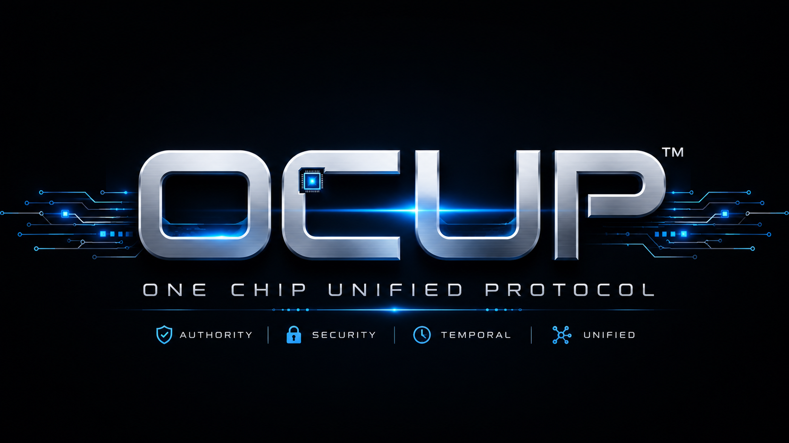

# AEGES Open Core

**An OCUP-aligned reference layer for governed value protection, quarantine, and restoration**

AEGES explores how economic and digital-asset systems can detect suspicious activity, place bounded holds on risky actions or value flows, preserve evidence, and require independent authority before release or restoration.

AEGES is not the authority substrate itself. It is an application layer designed to compose with **OCUP (One Chip Unified Protocol)** and its Temporal Authority Governance model.

> **The governed system cannot authorize, extend, restore, or enlarge its own operation.**

Applied to value systems, that means a transaction processor, wallet, bridge, model, or compromised host should not be able to release its own quarantine, renew its own privileged window, erase its own evidence, or restore a blocked capability without fresh external authority.

## Where AEGES fits

| Layer | Primary question | Role |
|---|---|---|
| **OCUP** | May this capability operate now? | Time-bounded authority, expiration, self-extension denial, and fail-closed gating |
| **QSAFP** | Can an AI-controlled capability continue or enlarge its operation? | AI and autonomous-system reference implementation beneath OCUP |
| **AEGES** | What happens to value or transactions when risk is detected? | Detection inputs, bounded quarantine, evidence, independent release, and restoration workflows |
| **RAAVE** | Is the machine or system presenting a current, externally observable authority state? | Identity, compliance signaling, lifecycle visibility, and noncompliance detection |

The layers are complementary. Detection does not create authority, and authority does not by itself determine economic risk.

## Design objective

AEGES is organized around a narrow governance rule:

> **A system placed into quarantine must not be able to release itself.**

A production AEGES deployment would separate:

1. **Detection** — signals or policy identify activity requiring review.
2. **Containment** — a bounded hold prevents the affected action or value flow from proceeding.
3. **Evidence** — the decision, context, authority state, and subsequent events are recorded.
4. **Independent decision** — authorized validators or human governance determine release, continuation, or restoration.
5. **Fresh authority** — release is a new transaction, not an extension of the quarantined system's prior authority.

This is a fail-safe governance pattern, not a remote kill-switch claim. Loss of valid authority should move protected capabilities toward a defined safe state; no single actor or governed component should possess unilateral restoration power.

## Public repository status

This repository is an **early public integration and demonstration surface**. It is useful for examining API shapes, provider adapters, mock analysis flows, and proposed governance concepts. It is not a production security controller.

| Surface | Status | Boundary |
|---|---|---|
| Node/Express demonstration API | **Present** | Accepts sample transaction data and returns mock or provider-assisted analysis |
| Input validation, rate limiting, health, and basic metrics code | **Present** | Reference-quality application logic; not independently security-audited |
| xAI, OpenAI, and Anthropic provider adapters | **Present** | Require user-supplied API credentials; provider output is not authoritative evidence |
| Mock transaction analysis | **Present** | Simulated output for demonstration only |
| Multi-provider aggregation | **Prototype** | Simple response aggregation and confidence handling—not Byzantine consensus |
| Transaction or wallet quarantine | **Concept / historical demo material** | No live asset custody, blockchain enforcement, or production hold mechanism in this repository |
| Rollback, recovery, or “digital DNA” tracing | **Concept** | No production restoration or forensic-attribution engine is established here |
| Post-quantum cryptography | **Planned architecture** | No production PQC implementation or validation is claimed |
| OCUP/QSAFP hardware enforcement | **External to this repository** | No private FPGA RTL, bitstream, physical-board proof, or non-bypassable hardware gate is published here |
| Distributed validator network | **Planned architecture** | No geographically or jurisdictionally distributed production quorum is operated by this repository |
| HSM custody, trusted time, attestation, and signed evidence export | **Production requirements** | Not implemented here |

No latency, accuracy, cost-efficiency, fraud-prevention, recovery, or production-readiness figure should be inferred from the mock delays, sample confidence values, example transactions, health responses, or narrative scenarios in this repository.

## What is runnable today

The current public code exposes a local demonstration API.

### Requirements

- Node.js 18 or later
- npm
- No provider API key is required for the mock path

### Start the local demo

```bash
git clone https://github.com/AEGES-OPEN-CORE/AEGES.git
cd AEGES
npm install
npm start
```

The service defaults to `http://localhost:3000`.

### Inspect the demo

```bash
curl http://localhost:3000/api/health
curl http://localhost:3000/api/demo
```

Submit a sample analysis request:

```bash
curl -X POST http://localhost:3000/api/analyze \
  -H "Content-Type: application/json" \
  -d '{
    "transactionData": {
      "id": "demo-001",
      "amount": 1000,
      "from": "0x1111",
      "to": "0x2222",
      "timestamp": 1787788800000,
      "network": "demo"
    }
  }'
```

The response is analytical demonstration output. It does **not** freeze funds, block a chain transaction, contact a regulator, establish legal status, or provide a production risk determination.

Optional provider keys can be supplied through environment variables:

```bash
export XAI_API_KEY="..."
export OPENAI_API_KEY="..."
export ANTHROPIC_API_KEY="..."
```

Use test credentials and non-sensitive synthetic data. Do not submit private financial, customer, authentication, or production transaction information to this reference service.

## Repository map

| Path | Purpose |
|---|---|
| `server.js` | Express demonstration service and API endpoints |
| `integration-kits/grok3/` | Provider adapter and API-example material |
| `aeges_llm_demo.js` | Standalone demonstration surface |
| `package.json` / `package-lock.json` | Reproducible public-demo dependency and command definitions |
| `Dockerfile` / `docker-compose.yml` | Bounded single-service container scaffolding; execution verification pending |
| `health_check.js` | Local health-check helper |
| `index.html` | Browser demonstration interface |
| `ARCHITECTURE.md` | Legacy architecture narrative; pending alignment with this README |
| `DEMO.md` | Legacy scenario narrative; not evidence of deployed capability |
| `deployment_guide.md` | Historical deployment target document; not a production-readiness attestation |
| `PREMIUM_FEATURES.md` | Historical commercial concept document; pending legal and technical review |
| `LICENSE` | Current repository licensing text; see the licensing note below |

The local Node path has been clean-installed and exercised for health, synthetic-demo generation, and mock analysis. Container files have been narrowed to the implemented service, but container execution remains pending verification in an environment with Docker.

## Evidence and claim discipline

AEGES distinguishes four kinds of statements:

- **Implemented** — code is present in this public repository.
- **Demonstrated** — a bounded scenario or mock flow can be executed.
- **Verified elsewhere** — evidence exists in another controlled project, with its own scope and provenance.
- **Planned** — a production requirement or research direction has been identified but not implemented here.

A model-generated risk label is not proof of fraud. A digital signature proves origin and integrity, not automatically the truth of the event recorded. Strong production evidence also requires an evidence path the governed or enforcement system cannot unilaterally fabricate, suppress, rewrite, or backdate.

Production-grade AEGES evidence therefore anticipates isolated key custody, trusted monotonic state, authenticated export, hash-linked records, and neutral or quorum witnessing.

## Relationship to verified OCUP work

The broader OCUP program has separately developed and tested temporal-authority behavior in software and FPGA RTL, including exact expiration, fail-closed gating, fresh-authority requirements, and self-extension denial. Those results support the governance substrate; they do not prove that this AEGES repository presently controls real assets or production infrastructure.

See:

- [OCUP](https://ocup.ai)
- [QSAFP Open Core](https://github.com/QSAFP-Core/qsafp-open-core)
- [AEGES](https://getaeges.org)

## Roadmap

The public roadmap is intentionally bounded:

1. Add deterministic tests for public transaction-analysis behavior.
2. Verify the bounded container path in a clean Docker environment.
3. Define a signed quarantine-decision and release-request evidence schema.
4. Bind quarantine release to fresh external authority rather than application-local state.
5. Separate model risk signals from enforceable policy decisions.
6. Add replay, stale-decision, duplicate-request, and unauthorized-release tests.
7. Define integration boundaries for hardware-rooted time, key custody, attestation, and OCUP capability gates.
8. Pursue independent review before making production, performance, compliance, or protection claims.

## Security

Do not use this repository to protect production assets. Please report suspected vulnerabilities through the process in [SECURITY.md](SECURITY.md). Do not include secrets, private keys, customer records, or exploit payloads in public issues.

## Licensing note

The current `LICENSE` file combines the standard MIT grant with additional use restrictions. Those forms are not equivalent, and this README does not attempt to interpret or repair that legal conflict. Users should review the complete license text and obtain qualified advice before relying on any permission—especially for commercial use.

Patent rights, trademarks, private implementations, and separately licensed materials are not granted merely because related public demonstration code is available.

## Governance and contact

AEGES is maintained as part of the OCUP-aligned work of Temporal Authority Systems PBC, DigiPie International PBC, and the Better World Regulatory Coalition initiative.

- Project site: [getaeges.org](https://getaeges.org)
- Governance and licensing inquiries: `licensing@bwrci.org`

---

**Detect risk. Bound the response. Preserve the evidence. Require fresh authority.**
